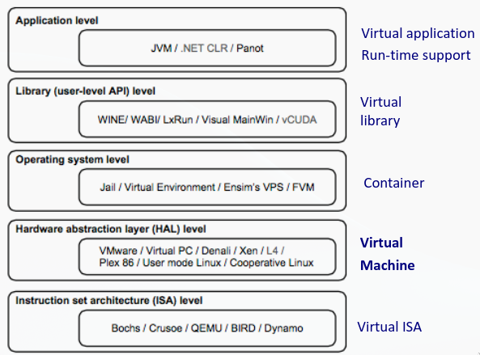
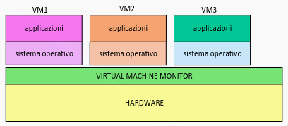

# Virtualizzazione

Dato un sistema costituito da un insieme di risorse, virtualizzare il sistema singifica presentare all'utilizzatore una visione delle risorse del sistema diversa da quella reale. Si introduce un livello di indirezione tra visione logica e fisica.

- Virtualizzazione a livello di processo, realizzata dal kernel
- Virtualizzazione della memoria, ogni processo vede uno spazio di indirizzamento indipendente, realizzata dal kernel

## Astrazione

In generale un oggetto astratto è la rappresentazione semplificata di una risorsa fisica:

- esibendo le proprieta' significative per l'utente
- nascondendo i dettagli realizzativi non necessari

Disaccoppiamento attraverso interfaccie per l'accesso all'oggetto astratto.

### Linguaggi di programmazione

Definizione di algoritmi attraverso linguaggi di alto livello eseguibili su architetture diverse, attraverso definizone di macchine virtuali.

## Emulazione

Esecuzione di un programma compilato per una particolare architettura su un sistema dotato di un diverso insieme di istruzioni. Vengono emulate interamente le singole istruzioni della macchina originale.

- Vantaggi: Interoperabilita' tra ambienti eterogenei
- Svantaggi: Prestazioni ridotte

L'emulazione viene implementata con due approcci:

### Interpretazione

L'interprete traduce ogni singola istruzione in una o piu' istruzioni della macchina ospitante.

- Grande flessibilita'
- Prestazioni ridotte, per una operazione sorgente corrisponde molteplici operazioni.

### Compilazione dinamica

Il sistema ospitante legge interi blocchi di codice e li traduce in maniera ottimizzata. Il codice tradotto viene bufferizzato e riutilizzato. I piu' noti emulatori utilizzano questa tecnica: Qemu, Virtual PC, Mame.

#### Qemu

Sistema di emulazione che permette di ottener architettura nuova e disgiunta. Permette di eseguire codice compilato per altre architetture. Usa la compilazione dinamica estremamente efficiente.

#### Virtual PC

Emulazione per computer Windows e MacOs per eseguire diverse verisioni dei sistemi operativi. Emula l'architettura x86 Intel ed era pensato per supportare l'uso di vecchie applicazioni.

#### MAME

Emulatore di macchine arcade per MS-DOS e successivi. Le prestazioni dei pc permettono l'interpretazione delle singole istruzioni senza ottimizzazioni

## Livelli di virtualizzazione

### Macchine virtuali

Singola piattaforma hardware viene condivisa da piu' macchine virtuali, ognuna con un proprio sistema operativo. Il disaccoppiamento e' realizzato dall'**Hypervisor** (virtual machine monitor), e' il mediatore unico nelle interazioni tra le macchine virtuali e l'hardware fisico. Garantisce:

- Isolamento tra macchine virtuali
- Stabilita' del sistema

#### Cenni storici

- Anni 60: 
  - IBM sistema CP/CMS. Sistema diviso in due parti CP (Control Program, analogo hypervisor) e CMS (Conversational Monitor System, sistema operativo monoutente). Tanti CMS quanti utenti.
  - IBM VM/370, sistema CP/CMS con supporto a piu' sistemi operativi
- Anni 70: sistemi operativi multitasking
- Anni 80: Crollo costo hardware, migrazione da mainframe a minicomputers.
- Anni 90: paradigma "one application, one server". Server dedicati a singole applicazioni, **sotto utilizzo** dell'hardware.
- Anni 2000: Nuovi sistemi di virtualizzazione.
- Anni 2010: Cloud computing, virtualizzazione su larga scala.

#### Vantaggi

- Piu' S.O. su un singolo hardware
- Isolamento ambienti di esecuzione
- Consolidamento hardware: utilizzo piu' efficiente delle risorse
- Gestione facilitata delle macchine: creazione vm, amministrazione, migrazione a caldo tra macchine fisiche.

